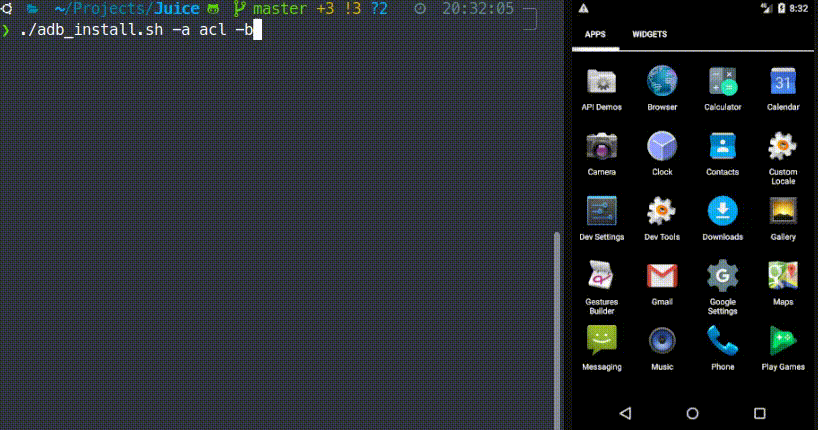
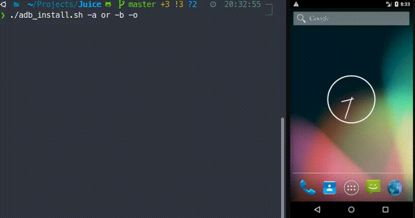
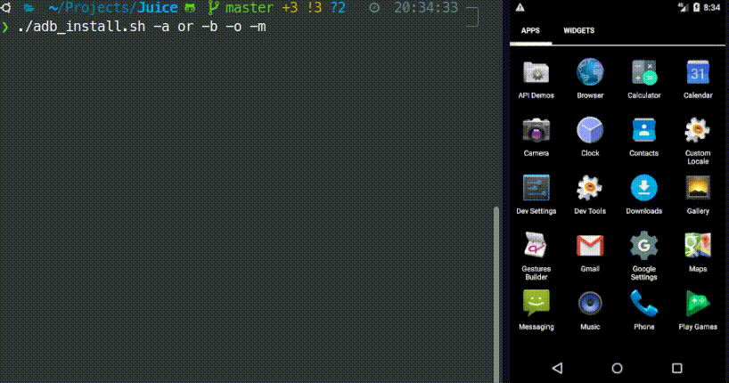
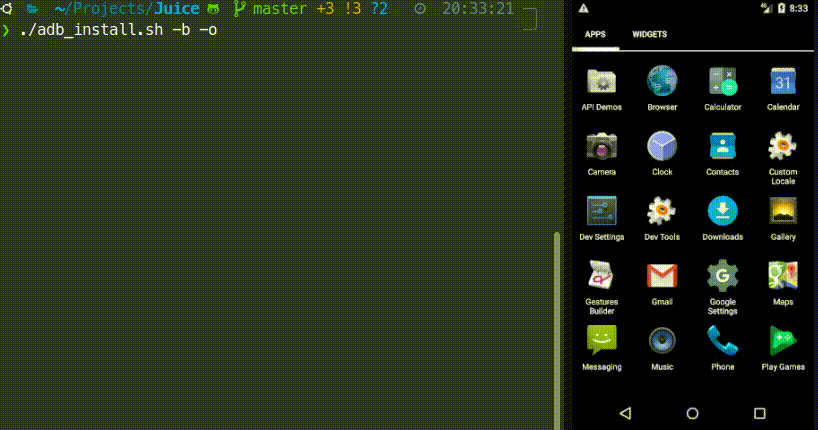

This is a companion project to one of my [blog posts](https://akjaw.com/blog/using_bash_to_build_and_install_android_flavors).
Basically this app has 6 different flavors, and the [adb_install.sh](https://github.com/AKJAW/bash-script-juice-companion-app/blob/master/adb_install.sh)
is used for a more streamlined installation process. The blog post dives
into a lot more details about the specifics of the script and this project.

The flavors:
- AppleProduction
- AppleMock
- OrangeProduction
- OrangeMock
- AppleCarrotLimeProduction
- AppleCarrotLimeMock

The flavor shortcuts in the script are:
- ap = apple
- or = orange
- acl = appleCarrotLime

Here's the script in action:

Just building and installing the appleCarrotLime production flavor

Building, installing and then opening the orange production flavor

The same as before but with a mock flavor

And without specifying any flavor

